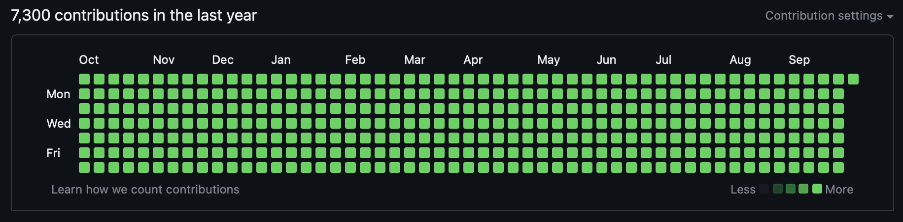

# Always Be Coding

Do you wish your GitHub contribution graph showed blazing green across the board?
Well, it's your lucky day! Now you can show the world how hardcore you are by **ALWAYS** coding. All you have to do is:

1. Fork this repo,
2. Clone your fork to your local machine
3. Configure a github ssh key for automated commits,
4. Run `python ./always_be_coding.py`

And the next thing you know, you'll be the envy of all your friends!

Remember, **ALWAYS** be coding:

